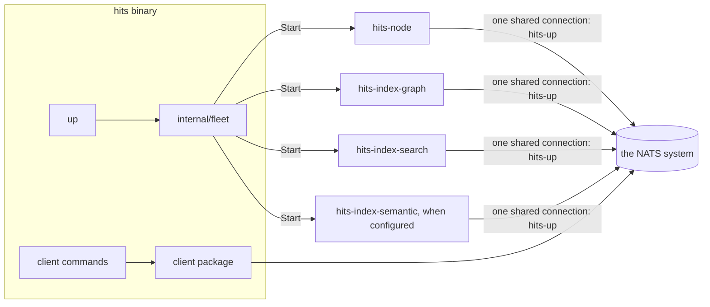

# `hits up` — the fleet as one process

The getting-started shape: the whole service fleet running as one process
inside the one `hits` binary, against whatever NATS system a context points
at — Synadia Cloud or a self-hosted server. Settled by decision
[0004](../03-DECISIONS/0004-hits-up.md); the services it composes are
[`services.md`](services.md), unchanged. Download `hits`, run
`hits up --context <name>`, and the same binary is the client you then work
with.



## The composition

One bounded tree, `internal/fleet`, exposes one `Start`: it connects and
starts all four services, fail-fast — any service that cannot start stops
the ones already running and exits non-zero. Stopping is the reverse:
signal, stop the services, close the connections. The tree may import the
four service package roots and `contract`, and nothing else; nothing
imports it back. The services themselves are untouched — `fleet` calls the
same `Start(ctx, nc)` entrypoints the standalone `cmd/` mains call.

`cmd/hits/main.go` dispatches `up` **before** delegating to the client
CLI's parser, so `internal/cli` stays a pure client and its depguard
denials stay untouched. `up`'s flags follow the subcommand, under its own
flagset:

```
hits up [--context <name>] [--max-bytes <size>]
        [--embedding-url <url> --embedding-model <m>]
```

Provisioning declares byte budgets (decision
[0005](../03-DECISIONS/0005-byte-budgets.md)): the ops stream defaults to
1 GiB with refuse-when-full semantics, `--max-bytes` changes it. Some
accounts — Synadia Cloud among them — require the budget; HITS declares it
everywhere.

## Connections

All four services share **one** connection, opened through the NATS
context under `nats.Name("hits-up")` (decision
[0006](../03-DECISIONS/0006-shared-connection-in-up.md), superseding
0004's per-service stance). Micro services multiplex on one connection by
design, and micro discovery still lists the four services individually —
but the whole platform now costs a single connection, plus one for the
client operating it: two concurrent, bootable on accounts with the
smallest connection allowances (issue 004 was Synadia Cloud refusing the
third of four). The standalone fleet binaries are separate processes and
keep their own connections and names.

## The semantic index is optional here

`up` starts `hits-index-semantic` only when the provider is configured
(`--embedding-url` and `--embedding-model`; key from
`HITS_EMBEDDING_API_KEY`). Unconfigured, the other three services boot and
one clear line says semantic search is off and which flags turn it on —
the fleet's stated degradation ([`services.md`](services.md) § embeddings)
made true at the getting-started surface. The standalone
`hits-index-semantic` binary keeps requiring its flags: running it at all
declares the intent to have embeddings.

## What ships

The release archives carry `hits` and `hits-mcp` — together they cover
every way of using HITS: `up` runs the platform, the client commands and
the MCP server operate it. The standalone fleet binaries stay buildable
and leave the archives; they return when a production consumer asks.

## Boundaries

The depguard amendment that admits `internal/fleet` also closes the hole
research 001 found: `cmd/**` was constrained by nothing. After it:

- `internal/fleet` may import the four service roots and `contract`;
  denied the adapters and `client`.
- Services and adapters are denied `internal/fleet` — composition is a
  one-way street.
- Each `cmd/` main is pinned to its own tree: `cmd/hits` to
  `internal/cli` + `internal/fleet`, each service main to its service,
  `cmd/hits-mcp` to `internal/mcp`.

The ops-log names (`hits-ops`, `hits-state`, the `hits.ops.>` subjects) —
previously declared once per service tree — live in `contract`, declared
once. One HITS per account or JetStream domain; the names carry no prefix
and there is no knob (decision 0004).

## What this does not do

- No embedded NATS server — `up` connects to a NATS system, it never
  becomes one. Returns only through a new decision.
- No new endpoints, no new surface — `up` runs the fleet of
  [`services.md`](services.md) exactly as designed; agents and humans still
  operate HITS through the client surface.
- No daemonizing, no supervision, no restarts — `up` is a foreground
  process; process management belongs to whatever runs it.
- No multi-tenancy — one account, one HITS, stated in the getting-started
  text.
