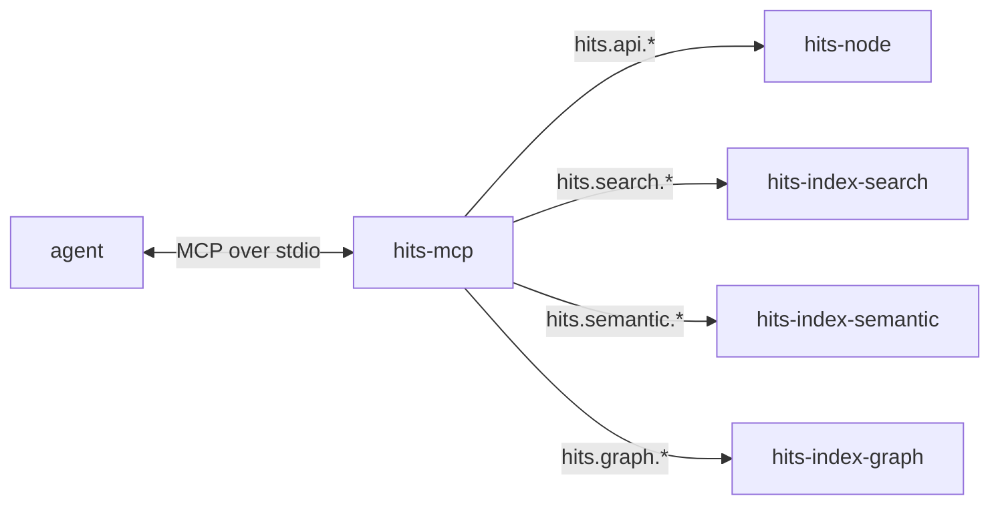

# The MCP server — `hits-mcp`

The agent action surface: an MCP stdio server exposing the client API to
agents as tools. Settled by decision
[0003](../03-DECISIONS/0003-mcp-server.md); the surface it fronts is
[`services.md`](services.md), the data those tools carry is
[`item-model.md`](item-model.md).

It is a client of the service fleet, never a peer: it serves no NATS
endpoints, subscribes to nothing, and owns no projection. Everything it can
do goes through the `client` package, and nothing is callable that is not
part of the client surface (how-we-build § headless).

## Shape

One process per agent, on the agent's machine, spoken to over stdio. On the
NATS side it is exactly what the CLI is: a caller resolving its connection
through a NATS context. Startup is fail-fast — resolve the context,
connect, ping the `hits` service, and only then serve MCP. A server that
cannot reach the fleet refuses to start instead of exposing tools that
cannot work.

The server is stateless: no cache, no queue, no retry beyond what a single
request carries. Every tool call is one client call; the fleet's answers
are the only state there is.

## The tool surface

One tool per client endpoint — the 1:1 rule from decision 0003, kept in
lockstep: adding a client endpoint means adding its tool in the same
change.

| Tool | Endpoint | Writes |
|---|---|---|
| `create_item` | `hits.api.create` | ✓ |
| `get_item` | `hits.api.get` | |
| `edit_item` | `hits.api.edit` | ✓ |
| `transition_item` | `hits.api.transition` | ✓ |
| `claim_item` | `hits.api.claim` | ✓ |
| `release_item` | `hits.api.release` | ✓ |
| `block_item` | `hits.api.block` | ✓ |
| `unblock_item` | `hits.api.unblock` | ✓ |
| `link_items` | `hits.api.link` | ✓ |
| `unlink_items` | `hits.api.unlink` | ✓ |
| `note_item` | `hits.api.note` | ✓ |
| `tombstone_item` | `hits.api.tombstone` | ✓ |
| `register_project` | `hits.api.project.register` | ✓ |
| `list_projects` | `hits.api.project.list` | |
| `search_items` | `hits.search.query` | |
| `semantic_search` | `hits.semantic.query` | |
| `graph_neighbors` | `hits.graph.neighbors` | |
| `graph_walk` | `hits.graph.walk` | |

Read-only tools carry the MCP read-only annotation, so hosts can offer them
without confirmation. `ping` is not a tool: it is the startup health check,
management rather than action.

Tool input schemas restate the client package's request types field for
field — minus `actor`, which the server supplies (below). Replies are
returned as the reply JSON unchanged. The MCP layer adds no vocabulary of
its own: the names an agent reads in a tool schema are the names in
[`item-model.md`](item-model.md).

## Actor

The acting handle is server configuration, required at startup — a flag or
`HITS_ACTOR`, the CLI's convention — validated for form at boot and stamped
on every write. Tools carry no actor parameter and no override: one process
is one actor. Authority is the caller's claim until identity derives from
NATS authentication, at which point the startup actor is verified rather
than claimed (decision [0002](../03-DECISIONS/0002-projects-and-actors.md)).

## Errors

Invariant rejections pass through verbatim: a failed tool call returns the
machine-legible code and message exactly as the service sent them
(`already-claimed: item … is claimed by …`), never rewritten. Agents are
the first-class operators; the invariant name *is* the interface.

## What this does not do

- **No streamable HTTP transport.** The server is agent-local; a network
  transport is a deployment story, and nothing is deployed
  ([`how-we-deploy.md`](../00-META/how-we-deploy.md)). It returns as its
  own decision when a shared install exists.
- **No MCP resources or prompts.** No present consumer; tools compose.
- **No folded convenience tools**, no batching, no server-side workflow.
  Composition is the agent's job.
- **No state.** Nothing to migrate, nothing to lose; killing the process is
  always safe.
