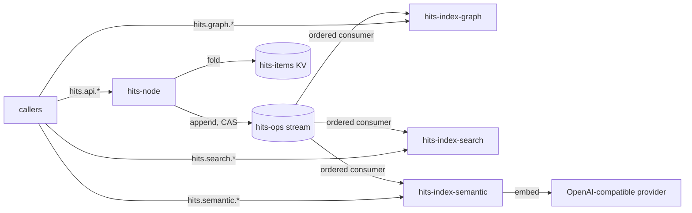

# The service fleet

Four binaries, four NATS micro services, one repo. Settled by decision
[0001](../03-DECISIONS/0001-item-store-architecture.md); the data they carry
is [`item-model.md`](item-model.md), the log they share is
[`ops-log.md`](ops-log.md). Per posture, every service answers the standard
micro discovery surface, and NATS is the only transport — anything speaking
another protocol (the future MCP server included) is a client of these
services, never a peer.

## hits-node — service `hits`

The single writer and the state server. It validates every command against
the item invariants before appending ([`ops-log.md`](ops-log.md) § writes),
folds the log into the `hits-items` KV projection, and serves state reads
from it.

Endpoints, under `hits.api.`:

| Endpoint | Does |
|---|---|
| `create` | mint an ID, append `created`, return the item |
| `get` | snapshot from KV; optionally the recent revisions the bucket's history holds |
| `edit` | non-lifecycle property changes |
| `transition` | status moves, closing transitions carrying `fixed-by` / `amended-design` |
| `claim` / `release` | claim intent; claim carries a steal flag, attributed in the op |
| `block` / `unblock` | blocked-with-memory ([`item-model.md`](item-model.md) § lifecycle) |
| `link` / `unlink` | typed edges |
| `note` | append a trail entry |
| `tombstone` | void a filing mistake |
| `project.register` / `project.list` | the `located-in` vocabulary — CAS-guarded registration, listing from the registry projection |

Machine-legible errors throughout: an invariant rejection names the invariant
— agents are the first-class operators. Every command names its `actor`, a
stable handle validated for form; its authority is the caller's claim until
identity derives from NATS authentication (decision
[0002](../03-DECISIONS/0002-projects-and-actors.md)).

## The index services

Each is a separate binary consuming `hits.ops.item.>` through its own ordered
consumer, holding an embedded, pure-Go (no cgo) projection rebuilt from
sequence 1 on boot, behind a store interface so an external store can slot in
later if scale ever demands it. While replaying, a service reports itself
not-ready. Indexes answer queries; they are never authority — every hit
resolves to an item ID, and state comes from `hits`.

| Binary | Service | Index | Endpoints |
|---|---|---|---|
| `hits-index-graph` | `hits-graph` | in-memory adjacency | `hits.graph.neighbors` — the neighbors of a node (item, repo, or actor), filterable by edge type and direction; `hits.graph.walk` — bounded-depth traversal |
| `hits-index-search` | `hits-search` | Bleve (scorch) | `hits.search.query` — full-text over reports and notes, filterable by type and status, paged |
| `hits-index-semantic` | `hits-semantic` | chromem-go | `hits.semantic.query` — nearest items to a text, with scores |

**The graph is wider than the links.** `hits-graph` holds the asserted
item↔item links, and beside them materializes project and actor nodes with
edges *derived* from properties and ops — `located-in`, `reported-by`,
`claimed-by`, and `blocked-by` while a block on another item stands
([`item-model.md`](item-model.md) § links). Exploration questions —
everything located in one project, everything one actor has claimed — are
graph queries without the write model carrying any of it. Project nodes
carry their registered names from the `registered` ops; actor nodes exist
only by reference; derived edges are recomputed on replay, like everything
else in the index.

**Embeddings.** `hits-index-semantic` produces vectors through a configured
OpenAI-API-compatible provider — base URL, API key, model name. It embeds
report and note text as ops arrive and embeds the query text at request time.
The provider is the one external dependency in the fleet; the other three
services function fully without it, and its outages degrade semantic search
only.

## What this does not do

- No HTTP surface, no UI — the micro endpoints are the product surface.
- No writes anywhere but `hits`; an indexer that disagrees with the log is
  rebuilt, not patched.
- No external index stores yet, and no config knobs for them — the store
  interface is the extension point when a real need arrives.
- No cross-item query in `hits` itself — list, search, and exploration belong
  to the indexers. (`project.list` is the one exception: a small closed
  vocabulary read from the registry projection, not a query.)
- No user records — an actor is a handle on the op, nothing more, until a
  real consumer appears.

## Code layout

All four binaries live in the `hits` repo, and stay cleanly separated:

- one `cmd/` entry and one package tree per service;
- a single shared **contract package** — the op envelope, the item model, the
  invariants, the ops-log names — that every service imports;
- **no service imports another**, and nothing outside a service's tree
  imports its internals — with one named exception: `internal/fleet`, the
  composition root behind `hits up` ([`hits-up.md`](hits-up.md), decision
  [0004](../03-DECISIONS/0004-hits-up.md)), calls the services' `Start`
  entrypoints and nothing deeper. The boundary is enforced by lint in CI,
  not by convention, so extracting a service into its own repo later is
  mechanical.

Whether the shared bootstrap (connection, config, micro scaffolding) becomes
a platform library is still open ([`repos.md`](../00-META/repos.md)); it
starts as part of the contract package's neighborhood and earns extraction by
a second real consumer, per the minimal-feature posture.
